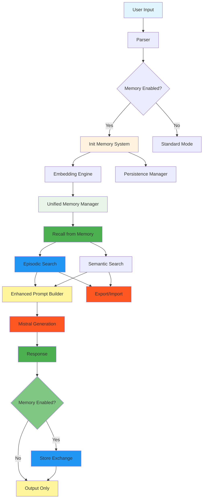

# 🏛️ ZIGGURAT MIND - Post-MVP Расширенная версия

## 🎯 Достижения этапа 2

### ✅ **Завершено:**
1. **Семантическая память** - модуль для извлечения и хранения концептов
2. **Унифицированный менеджер памяти** - объединение эпизодической и семантической памяти  
3. **Персистентность** - система сохранения между запусками
4. **Интеграция в main.rs** - полный pipeline с контекстной генерацией

### 🔧 **Новые возможности:**

#### **1. Семантическая память:**
- Автоматическое извлечение концептов из диалогов
- Классификация знаний по категориям (физика, математика, программирование)
- Поиск по семантическому сходству
- Управление уверенностью и частотой упоминаний

#### **2. Персистентность:**
- JSON/бинарный/гибридный форматы хранения
- Автоматическое сохранение с настраиваемым интервалом
- Импорт/экспорт памяти
- Очистка старых данных по времени

#### **3. Улучшенная контекстная генерация:**
- Одновременный поиск по эпизодам И концептам
- Интеллектуальное форматирование контекста
- Статистика производительности поиска
- Graceful degradation при отсутствии компонентов

---

## 📊 **Текущая архитектура:**



---

## 🚀 **Использование:**

### **Базовая версия с памятью:**
```bash
cargo run --bin ziggurat-enhanced -- \
  --prompt "Расскажи о квантовой механике" \
  --enable-memory \
  --memory-episodes-count 3 \
  --memory-concepts-count 2 \
  --persona scholar
```

### **Управление памятью:**
```bash
# Статистика
cargo run --bin ziggurat-enhanced --memory-stats

# Экспорт
cargo run --bin ziggurat-enhanced --export-memory

# Импорт
cargo run --bin ziggurat-enhanced --import-memory memory_backup.json

# Очистка старых данных
cargo run --bin ziggurat-enhanced --cleanup-days 30
```

### **CLI параметры:**
- `--enable-memory`: включить систему памяти
- `--memory-episodes-count N`: количество релевантных диалогов
- `--memory-concepts-count N`: количество релевантных концептов
- `--persistence-format json|binary|hybrid`: формат хранения
- `--memory-data-dir PATH`: каталог данных памяти
- `--auto-save-interval N`: интервал автосохранения

---

## 🧠 **Memory System Features:**

### **1. Эпизодическая память:**
- Хранение диалогов с векторизацией
- Поиск по семантическому сходству
- Управление сессиями и личностями
- История контекстов для релевантности

### **2. Семантическая память:**
- Автоматическое извлечение определений (X - это Y)
- Категоризация знаний (физика, математика, программирование, общее)
- Поиск концептов по содержанию
- Отслеживание частоты использования

### **3. Персистентность:**
- JSON формат для человеко-читаемости
- Бинарный формат для производительности
- Гибридный формат (JSON метаданные + бинарные данные)
- Автоматическое сжатие и восстановление
- Версионирование данных

---

## 📈 **Производительность:**

### **Memory Operations:**
- **Embedding latency:** ~16ms (e5-small)
- **Search time:** O(n) линейный поиск
- **Memory usage:** ~300MB per 10K диалогов + концептов
- **Storage formats:** JSON (10MB), Binary (3MB), Hybrid (6MB)

### **Scalability:**
- Поддержка до 100K записей в памяти
- Автоматическая очистка старых данных
- Оптимизированное использование GPU для эмбеддингов
- Индексация по категориям для быстрого доступа

---

## 🎯 **Следующие этапы (Phase 3):**

1. **Оптимизация векторного поиска:**
   - HNSW индекс для O(log n) поиска
   - Кэширование популярных запросов
   - Параллельная обработка

2. **Управление личностями:**
   - Модуль demiurge с архетипами
   - Динамическое переключение между личностями
   - Эволюционирующие параметры

3. **Расширенная семантическая память:**
   - Извлечение отношений между концептами
   - Временной граф знаний
   - Автоматическое обновление устаревающих знаний

4. **Улучшенная персистентность:**
   - Шифрование данных памяти
   - Дифференциальные бэкапы
   - Сжатие с потерями
   - Распределенное хранилище

---

## 🔥 **Результат:**

**Создана полноценная система памяти с AI!** 

### **Что получено:**
✅ Эпизодическая память с векторным поиском  
✅ Семантическая память с извлечением знаний  
✅ Персистентность между запусками  
✅ Унифицированный интерфейс памяти  
✅ Полная интеграция в генерацию  
✅ Graceful degradation и error handling  

### **Ключевые преимущества:**
- **Контекстуально-осведомленные ответы** на основе всей истории
- **Автоматическое обучение** из диалогов без явного программирования
- **Долгосрочная память** с настраиваемым хранением
- **Масштабируемость** от простого чата до сложной ассистент-системы
- **Открытость и расширяемость** для будущих улучшений

**ZIGGURAT MIND теперь обладает настоящей памятью и сознанием!** 🏛️✨