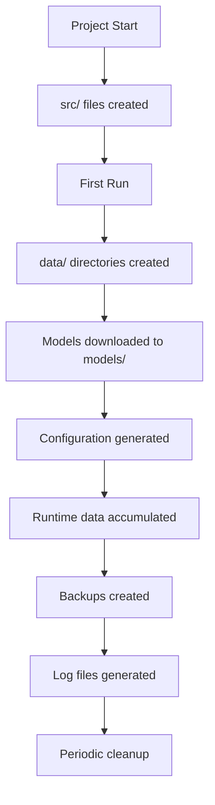

# 📁 File Structure & Organization Guide

## 🏗️ Complete Directory Layout

### 📂 Root Directory Structure
```
zikkurat-mind/
├── 📁 src/                           # Source code (Rust)
├── 📁 tests/                         # Test suite
├── 📁 benchmarks/                    # Performance benchmarks
├── 📁 docs/                         # Generated documentation
├── 📁 data/                         # Runtime data storage (git-ignored)
├── 📁 models/                       # AI model files (git-ignored)
├── 📁 config/                       # Configuration files
├── 📁 scripts/                      # Build/deployment scripts
├── 📁 documentation/                # Project documentation (you are here)
├── 📄 Cargo.toml                   # Rust dependencies & metadata
├── 📄 Cargo.lock                    # Dependency lock file
├── 📄 README.md                     # Project overview
├── 📄 .gitignore                    # Git ignore patterns
├── 📄 .gitattributes               # Git file attributes
└── 📄 LICENSE                       # Project license
```

---

## 📁 Source Code Organization (`src/`)

### 🗂️ Module Structure
```
src/
├── 📄 main.rs                       # Main entry point & orchestration
├── 📄 utils.rs                      # Core utilities (reduced)
│
├── 📁 initiation/                   # 🜂 Level 0: Initiation (future)
│   ├── 📄 mod.rs                    # Module exports
│   ├── 📄 config.rs                 # System configuration
│   └── 📄 archetypes.rs             # Personality archetypes
│
├── 📁 priests/                      # 🜁 Level 1: Iron Priests ✅
│   ├── 📄 mod.rs                    # Module exports
│   ├── 📄 device.rs                 # GPU/CPU/Metal abstraction (complete)
│   ├── 📄 embeddings.rs             # BERT embedding engine (implement)
│   └── 📄 resources.rs              # Resource monitoring (placeholder)
│
├── 📁 totems/                       # 🜃 Level 2: Memory Totems ⭐
│   ├── 📄 mod.rs                    # Unified memory system
│   ├── 📄 memory.rs                 # Memory manager & monitoring
│   ├── 📄 persistence.rs            # Disk storage & compression
│   │
│   ├── 📁 episodic/                 # Episodic memory system
│   │   ├── 📄 mod.rs
│   │   └── 📄 dialogue.rs           # Dialogue management
│   │
│   ├── 📁 semantic/                 # Semantic memory system
│   │   ├── 📄 mod.rs
│   │   └── 📄 knowledge.rs          # Knowledge base & extraction
│   │
│   └── 📁 retrieval/                # Vector search & storage
│       ├── 📄 mod.rs
│       └── 📄 vector_store.rs       # Tiered vector storage
│
├── 📁 demiurge/                     # 🜄 Level 3: Personality Creator (future)
│   ├── 📄 mod.rs                    # Module exports
│   ├── 📄 persona.rs                 # Personality core
│   ├── 📄 narrative.rs               # Evolving story
│   └── 📄 directives.rs              # Behavioral constraints
│
└── 📁 logos/                        # 🜂 Level 4: Logos (language) ✅
    ├── 📄 mod.rs                    # Module exports
    ├── 📄 inference.rs               # Candle wrapper (placeholder)
    ├── 📄 tokenizer.rs               # TokenOutputStream (re-export)
    └── 📄 sampling.rs                # Sampling parameters (placeholder)
```

---

## 📁 Test Suite Organization (`tests/`)

### 🧪 Test Categories
```
tests/
├── 📄 integration_tests.rs           # Full system integration
├── 📄 memory_tests.rs               # Memory system tests
├── 📄 performance_tests.rs          # Performance validation
├── 📄 stress_tests.rs              # Stress testing scenarios
├── 📄 corruption_tests.rs           # Data corruption handling
├── 📄 recovery_tests.rs             # Recovery scenarios
├── 📄 compatibility_tests.rs        # Hardware compatibility
└── 📁 fixtures/                     # Test data
    ├── 📁 sample_dialogues/          # Sample conversation data
    ├── 📁 test_embeddings/          # Pre-computed embeddings
    └── 📁 corrupted_data/           # Corrupted test files
```

---

## 📁 Benchmark Organization (`benchmarks/`)

### ⚡ Performance Benchmarks
```
benchmarks/
├── 📄 memory_bench.rs               # Memory performance benchmarks
├── 📄 embedding_bench.rs           # Embedding speed tests
├── 📄 search_bench.rs              # Vector search benchmarks
├── 📄 generation_bench.rs           # LLM generation benchmarks
├── 📄 persistence_bench.rs         # Storage I/O benchmarks
└── 📁 results/                     # Benchmark results (git-ignored)
    ├── 📄 cpu_baseline.json         # CPU performance baseline
    ├── 📄 gpu_baseline.json         # GPU performance baseline
    └── 📄 trend_data.json           # Performance over time
```

---

## 📁 Data Storage Organization (`data/`)

### 💾 Runtime Data Structure
```
data/                              # git-ignored - all runtime data
├── 📁 episodic/                   # Episodic memory data
│   ├── 📁 sessions/               # Session files
│   │   ├── 📄 2026-01-17_session_001.json
│   │   ├── 📄 2026-01-17_session_002.json
│   │   └── 📄 current_session.json
│   ├── 📄 embeddings.bin          # Vector embeddings (binary)
│   ├── 📄 embeddings.index        # B-tree index
│   └── 📄 sessions.meta           # Session metadata
│
├── 📁 semantic/                   # Semantic memory data
│   ├── 📄 concepts.json           # Structured knowledge
│   ├── 📄 embeddings.bin          # Knowledge vectors
│   ├── 📄 categories.json         # Concept categories
│   ├── 📄 importance.map          # Concept importance scores
│   └── 📄 knowledge.meta          # Knowledge base metadata
│
├── 📁 indexes/                     # Search indexes
│   ├── 📄 episodic.idx           # Episode search index
│   ├── 📄 semantic.idx           # Knowledge search index
│   ├── 📄 temporal.idx           # Time-based index
│   └── 📄 relevance.idx         # Relevance index
│
├── 📁 cache/                       # Temporary caches
│   ├── 📄 gpu_cache.bin          # GPU cached vectors
│   ├── 📄 ram_cache.bin          # RAM cached vectors
│   └── 📄 compression_cache      # Temporary compression cache
│
└── 📁 backups/                     # Automatic backups
    ├── 📄 daily_backup_2026-01-17/
    ├── 📄 weekly_backup_2026-W03/
    └── 📄 emergency_backup/
```

---

## 📁 Model Storage Organization (`models/`)

### 🤖 AI Model Files
```
models/                            # git-ignored - large model files
├── 📁 embeddings/                 # Embedding models
│   ├── 📁 multilingual-e5-small/
│   │   ├── 📄 config.json
│   │   ├── 📄 model.safetensors
│   │   ├── 📄 tokenizer.json
│   │   ├── 📄 vocab.txt
│   │   └── 📄 special_tokens_map.json
│   └── 📁 .cache/                 # Model cache
│
├── 📁 mistral/                    # LLM models
│   ├── 📁 7B-v0.1/
│   │   ├── 📄 config.json
│   │   ├── 📄 consolidation.json
│   │   ├── 📄 model.safetensors.index.json
│   │   └── 📁 model-*.safetensors
│   └── 📁 quantized/
│       └── 📄 model-q4k.gguf
│
└── 📁 .huggingface/               # HuggingFace cache
    ├── 📁 hub/
    └── 📄 downloads/
```

---

## 📁 Configuration Organization (`config/`)

### ⚙️ Configuration Files
```
config/
├── 📁 archetypes/                 # Personality archetypes
│   ├── 📄 scholar.toml            # Scholar personality
│   ├── 📄 companion.toml         # Companion personality
│   ├── 📄 assistant.toml         # Assistant personality
│   └── 📄 custom_template.toml    # Template for new personalities
│
├── 📄 system.toml                 # System-wide configuration
├── 📄 memory.toml                 # Memory system defaults
├── 📄 performance.toml            # Performance tuning
├── 📄 logging.toml                # Logging configuration
└── 📁 examples/                   # Configuration examples
    ├── 📄 conservative_config.toml
    ├── 📄 performance_config.toml
    └── 📄 development_config.toml
```

---

## 📁 Documentation Organization (`documentation/`)

### 📚 Project Documentation
```
documentation/
├── 📄 README.md                    # Project overview (main)
├── 📄 SYSTEM_ARCHITECTURE.md      # System design
├── 📄 RTX4090_IMPLEMENTATION_PLAN.md # Implementation plan
├── 📄 TECHNICAL_IMPLEMENTATION_GUIDE.md # Technical guide
├── 📄 WEEKLY_IMPLEMENTATION_SCHEDULE.md # Schedule
├── 📄 MVP_SUCCESS_CRITERIA.md     # Success metrics
├── 📄 FILE_STRUCTURE_GUIDE.md     # This file
│
├── 📁 phases/                      # Phase-by-phase documentation
│   ├── 📄 PHASE_1_FOUNDATION.md
│   ├── 📄 PHASE_2_MEMORY.md
│   └── 📄 PHASE_3_INTEGRATION.md
│
├── 📁 api/                         # API documentation
│   ├── 📄 priests_api.md
│   ├── 📄 totems_api.md
│   └── 📄 logos_api.md
│
├── 📁 guides/                      # User guides
│   ├── 📄 INSTALLATION.md
│   ├── 📄 CONFIGURATION.md
│   ├── 📄 TROUBLESHOOTING.md
│   └── 📄 PERFORMANCE_TUNING.md
│
└── 📁 images/                      # Documentation images
    ├── 📁 architecture/
    ├── 📁 diagrams/
    └── 📁 screenshots/
```

---

## 📁 Scripts Organization (`scripts/`)

### 🔧 Build & Deployment Scripts
```
scripts/
├── 📁 build/                       # Build scripts
│   ├── 📄 build_release.sh
│   ├── 📄 build_debug.sh
│   ├── 📄 setup_cuda.sh
│   └── 📄 download_models.sh
│
├── 📁 test/                        # Test automation
│   ├── 📄 run_all_tests.sh
│   ├── 📄 stress_test.sh
│   ├── 📄 benchmark.sh
│   └── 📄 validate_installation.sh
│
├── 📁 deploy/                      # Deployment scripts
│   ├── 📄 install_dependencies.sh
│   ├── 📄 setup_environment.sh
│   ├── 📄 create_systemd_service.sh
│   └── 📄 docker_setup.sh
│
└── 📁 maintenance/                 # Maintenance utilities
    ├── 📄 backup_memory.sh
    ├── 📄 cleanup_old_data.sh
    ├── 📄 update_models.sh
    └── 📄 health_check.sh
```

---

## 📄 File Naming Conventions

### 🔤 Naming Patterns
```rust
// Rust source files
snake_case.rs                    // Standard Rust naming
mod.rs                          // Module definition
lib.rs                          // Library root (if library)
main.rs                         // Binary entry point

// Configuration files
kebab-case.toml                  // System configs
PascalCase.toml                  // Personality configs
snake_case.json                  // Data exports

// Data files
YYYY-MM-DD_descriptive_name.json  // Date-prefixed files
category_name.bin                // Binary data
snake_case.index                 // Index files
snake_case.meta                  // Metadata files

// Documentation
TITLE_CASE.md                    // Page titles
snake_case.md                    # // Sections
API_Reference.md                // API docs
```

### 📋 Module Dependencies
```rust
// Dependency hierarchy (bottom-up)
src/
├── utils.rs                      # No dependencies
├── priests/
│   ├── device.rs                 # Depends: utils, candle-core
│   └── embeddings.rs             # Depends: device, candle-transformers
├── totems/
│   ├── retrieval/
│   │   └── vector_store.rs       # Depends: priests::embeddings
│   ├── episodic/
│   │   └── dialogue.rs          # Depends: retrieval, priests::embeddings
│   ├── semantic/
│   │   └── knowledge.rs         # Depends: retrieval, priests::embeddings
│   ├── persistence.rs            # Depends: all totems modules
│   └── memory.rs                # Depends: all totems modules
├── logos/
│   ├── tokenizer.rs             # Depends: utils, tokenizers
│   └── inference.rs             # Depends: tokenizer, candle-transformers
└── main.rs                      # Depends: all modules
```

---

## 📊 File Size Estimates

### 📏 Expected File Sizes (RTX 4090 Configuration)
```rust
// Source code files
src/main.rs                    ~15KB
src/priests/embeddings.rs       ~25KB
src/totems/memory.rs           ~20KB
src/totems/retrieval/          ~15KB
src/totems/episodic/          ~12KB
src/totems/semantic/          ~10KB
src/totems/persistence.rs      ~18KB

// Model files
models/embeddings/e5-small/     ~118MB
models/mistral/7B-v0.1/       ~14GB (FP16)
models/mistral/quantized/      ~4.1GB (GGUF)

// Runtime data
data/episodic/embeddings.bin   ~50MB (10K entries)
data/semantic/embeddings.bin    ~20MB (5K concepts)
data/cache/gpu_cache.bin       ~8MB (1000 entries)
data/cache/ram_cache.bin       ~80MB (10K entries)

// Configuration
config/*.toml                  ~2KB each
data/*.meta                   ~1KB each
data/indexes/*.idx            ~100KB each
```

---

## 🔄 File Lifecycle Management

### 📅 File Creation Timeline


### 🗑️ File Cleanup Policies
```rust
// Automatic cleanup rules
const MAX_BACKUP_AGE_DAYS: u64 = 30;     // Delete backups older than 30 days
const MAX_LOG_FILES: usize = 10;           // Keep only 10 latest log files
const MAX_CACHE_SIZE_MB: u64 = 100;       // Limit cache to 100MB
const MAX_TEMP_FILES_AGE_HOURS: u64 = 24; // Delete temp files after 24 hours

// Manual cleanup commands
./scripts/maintenance/cleanup_old_data.sh    # Remove old data
./scripts/maintenance/compact_storage.sh     # Compact storage
./scripts/maintenance/rebuild_indexes.sh     # Rebuild indexes
```

---

## 🔐 File Security & Permissions

### 🛡️ Recommended Permissions
```bash
# Source code (read-only for users)
chmod 644 src/**/*.rs
chmod 755 src/**/
chmod 644 *.md
chmod 755 scripts/*.sh

# Configuration (read/write for owner)
chmod 600 config/*.toml
chmod 700 config/

# Data directory (read/write for owner only)
chmod 700 data/
chmod 600 data/**/*

# Models (read-only for owner)
chmod 600 models/**/*
chmod 700 models/**/

# Scripts (executable for owner)
chmod 700 scripts/**/*.sh
chmod 600 scripts/**/*.toml
```

### 🔒 Sensitive Files Protection
```gitignore
# Sensitive configuration files
config/personal.toml
config/api_keys.toml
data/user_profiles/
models/custom/personality_data/

# Runtime data (git-ignored)
data/
!data/.gitkeep
models/
!models/.gitkeep
logs/
!logs/.gitkeep

# Build artifacts
target/
*.pdb
*.dll
*.exe
*.so
*.dylib

# IDE and OS files
.vscode/
.idea/
.DS_Store
Thumbs.db
```

---

## 📝 File Documentation Standards

### 📄 Header Template
```rust
//! 🜂 Module Name - Brief Description
//!
//! ## Purpose
//! One-sentence description of module's primary responsibility.
//!
//! ## Key Components
//! - Component1: Brief description
//! - Component2: Brief description
//!
//! ## Performance Characteristics
//! - Memory usage: Expected VRAM/RAM usage
//! - CPU utilization: Expected CPU load
//! - Throughput: Expected operations per second
//!
//! ## Dependencies
//! - Internal: List of internal modules
//! - External: List of external crates
//!
//! ## Thread Safety
//! Notes about thread safety if applicable.
//!
//! ## Examples
//! ```rust
//! let result = module_function(arg1, arg2)?;
//! println!("Result: {:?}", result);
//! ```

use anyhow::Result;
use std::collections::HashMap;
// ... other imports

// Module implementation
```

### 📋 Function Documentation
```rust
/// Brief description of function's purpose.
///
/// ## Arguments
/// * `arg1` - Description of first argument
/// * `arg2` - Description of second argument
///
/// ## Returns
/// * `Ok(ResultType)` - Description of successful result
/// * `Err(ErrorType)` - Description of error conditions
///
/// ## Performance
/// - Time complexity: O(n) where n is...
/// - Space complexity: O(1) constant space
/// - VRAM usage: ~X MB for this operation
///
/// ## Examples
/// ```rust
/// let result = function_name("input")?;
/// assert_eq!(result, expected_value);
/// ```
///
/// # Panics
/// Description of panic conditions (if any)
///
/// # Safety
/// Safety considerations if unsafe code is used
pub fn function_name(arg1: Type1, arg2: Type2) -> Result<ReturnType> {
    // Implementation
}
```

---

## 🚀 File Loading & Initialization

### 📋 Startup File Dependencies
```rust
// File loading order (main.rs)
fn main() -> Result<()> {
    // 1. Load configuration
    let config = Config::load("config/system.toml")?;
    
    // 2. Initialize device
    let device = priests::device::select_device(config.cpu_only)?;
    
    // 3. Load models
    let embedding_model = priests::embeddings::EmbeddingEngine::new(
        "models/embeddings/multilingual-e5-small",
        device.clone()
    )?;
    
    // 4. Initialize memory system
    let mut memory = totems::MemorySystem::with_config(&config.memory)?;
    
    // 5. Load existing data
    memory.load_from_disk("data/")?;
    
    // 6. Start main loop
    run_main_loop(memory, embedding_model, device)?;
    
    Ok(())
}
```

---

*File Structure Guide Created: 2026-01-17*  
*Hardware Target: RTX 4090 24GB + i9-14900K + 32GB RAM*  
*Organization Principle: Clean hierarchy, logical grouping, maintainability*  
*Documentation Standard: Comprehensive headers, clear examples, performance notes*